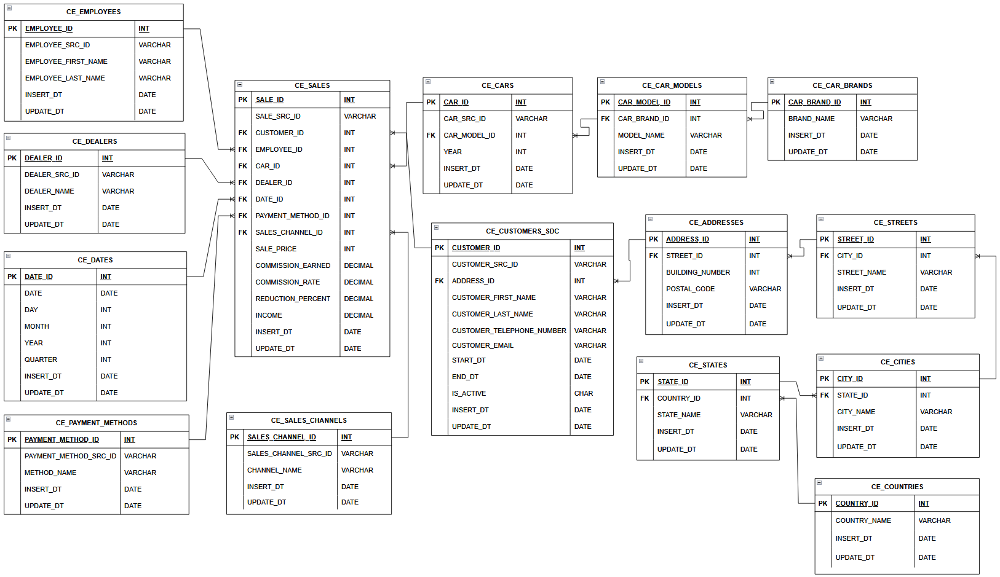
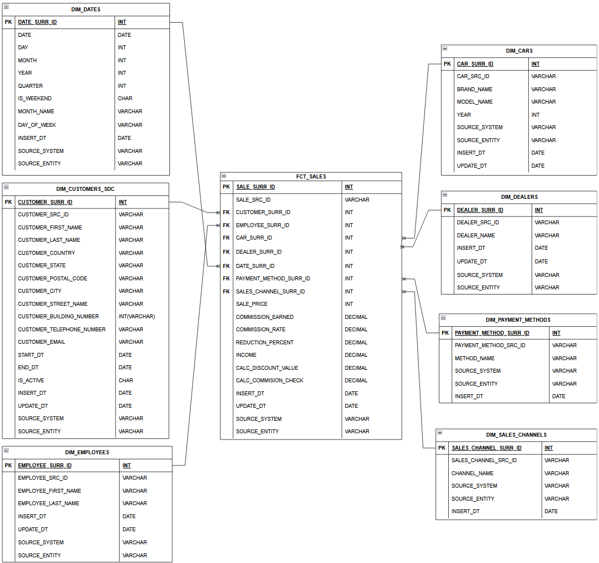
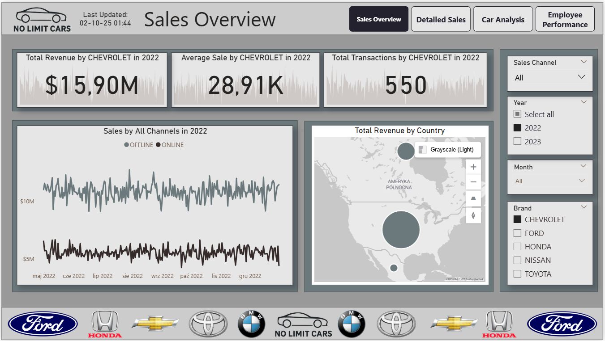

# DWH Car Sales – Data Warehouse for Automotive Sales  

## Introduction  
**DWH Car Sales** is a complete Data Warehouse project implemented in **PostgreSQL (PL/pgSQL)**.  
It integrates car sales data from both **online** and **offline** channels, enabling advanced analytics and business intelligence reporting for dealership network.  

The project covers the full ETL process:  
- ingestion of CSV sources,  
- staging transformations,  
- loading into a normalized **3NF layer**,  
- building a **dimensional Data Mart (star schema)** for reporting,  
- logging and monitoring of all ETL processes.  

---

## Key Features  

- **Full ETL pipeline in PostgreSQL (PL/pgSQL)** – from CSV sources to Data Mart.  
- **Layered architecture** – Staging → 3NF → Data Mart (Dimensional Model).  
- **SCD Type 2** for the **Customer dimension**, enabling historical tracking of changes.  
- **Incremental loading (IOTD – Incremental Over Time Data)** – optimized for performance and minimizing reprocessing.  
- **Partitioned Fact Table** (`FCT_SALES`) by date for efficient time-series queries.  
- **Comprehensive logging** – dedicated `LOG_TABLE` and `LOG_PROCEDURE` to track ETL execution, affected rows, and error handling.  
- **Support for hybrid sources** – handling structural differences between **offline** and **online** sales datasets.  

---

## Architecture  

The architecture consists of 4 main layers:  

1. **Sources**  
   - Two CSV datasets:  
     - `car_sales_offline.csv` – traditional dealer transactions.  
     - `car_sales_online.csv` – e-commerce transactions.  

2. **Staging**  
   - Temporary layer for initial data loading and validation.  

3. **BL_3NF (Business Layer – 3rd Normal Form)**  
   - Normalized storage ensuring data integrity and consistency.  
   - Includes key entities: `CE_CUSTOMERS_SDC`, `CE_SALES`, `CE_CARS`, `CE_DEALERS`, etc.  

  
    

4. **BL_DM (Business Layer – Data Mart)**  
   - Star schema for reporting and analytics.  
   - Dimensions (customers, cars, employees, dealers, dates, etc.) and fact table (`FCT_SALES`).  

  
    

 

5. **BL_CL (Control Layer)**  
   - Logging schema with:  
     - `LOG_TABLE` – ETL execution log.  
     - `LOG_PROCEDURE` – procedure for centralized logging with error handling.  

---

## BL_3NF Overview  
- **Addresses**: hierarchical model of countries, states, cities, streets, and addresses.  
- **Cars**: `CE_CAR_BRANDS → CE_CAR_MODELS → CE_CARS`.  
- **Customers**: slowly changing dimension (`CE_CUSTOMERS_SDC`, SCD Type 2).  
- **Sales**: `CE_SALES` – transactional fact table in normalized form.  

---

## BL_DM Overview  

### Dimensions  
- `DIM_DATES` – calendar with extended attributes (day of week, weekend, month name).  
- `DIM_CARS` – flattened car hierarchy.  
- `DIM_CUSTOMERS_SDC` – customers with full address and historical tracking.  
- `DIM_DEALERS`, `DIM_EMPLOYEES`, `DIM_PAYMENT_METHODS`, `DIM_SALES_CHANNELS`.  

### Fact Table  
- **FCT_SALES** (partitioned by date):  
  - Sales price, commission, discount, income.  
  - Derived metrics:  
    - `CALC_DISCOUNT_VALUE = SALE_PRICE * (REDUCTION_PERCENT / 100)`  
    - `CALC_COMMISSION_CHECK = SALE_PRICE * COMMISSION_RATE`  

---

## ETL Process  

1. **CSV → Staging**  
   - Load raw data from online/offline sales CSVs.  

2. **Staging → BL_3NF**  
   - Data normalization and validation.  
   - Deduplication, mapping to reference tables.  
   - Priority handling (offline over online where overlaps occur).  

3. **BL_3NF → BL_DM**  
   - Denormalization and star schema creation.  
   - Adding analytical attributes in dimensions.  
   - Deriving additional metrics in fact tables.  

4. **Logging & Monitoring (BL_CL)**  
   - All ETL procedures log execution details:  
     - procedure name,  
     - number of rows processed,  
     - status (success/error),  
     - custom messages.  

---

## Interactive Dashboard & Analytics

Built an interactive **Power BI dashboard** for end-to-end car sales analytics and KPI monitoring — powered by data from the DWH.

[View Repository](https://github.com/IvanFilipchuk/Car_Sales_Dashboard)

### Dashboard Preview

  
    

 

---
